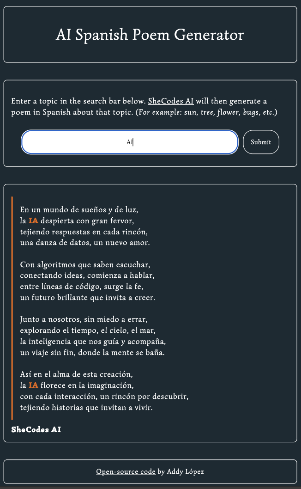

# AI Spanish Poem Generator

**_View this project:_** [https://ai-content-generator-al.netlify.app/](https://ai-content-generator-al.netlify.app/)

## Description & Usage

This application was built in HTML, CSS, and JavaScript and integrates with the SheCodes Artificial Intelligence API to generate dynamic content based on the user's input. Enter a topic in the search bar. SheCodes AI will then generate a poem in Spanish about that topic.

## Coding Features

- **_Artificial Intelligence:_** prompt engineering with precise contextual instructions to curate and style the generated output. The AI is specifically instructed in my code to produce the results in HTML with appropriate line breaks, to apply a CSS class to the translated search term for textual highlighting if it appears in the poem, and to sign each poem at the end with "SheCodes AI."

- **_JavaScript:_** Typewriter Plugin for generated AI text, integration with AI API using a public API key and AXIOS, form handling of user input, dynamic injection of generated text into the HTML skeleton

- **_CSS:_** responsive web design for screens of all sizes, custom font, dynamically applied utility class for text highlighting of user's search term(s)

- **_HTML:_** accessible semantic tags, form handling, functional search bar, logical structure

- Coded in VS Code with tools for a **_professional development workflow, version control, and continuous deployment_**, such as Live Server, Git, GitHub, and hosting on Netlify

## Accessibility Rating

- **_Accessibility rating_** by Lighthouse audit: 100/100 for desktops, 100/100 for mobile devices.

## Project Previews

## Attribution

- SheCodes AI API Documentation: [https://www.shecodes.io/learn/apis/ai](https://www.shecodes.io/learn/apis/ai)
- TypewriterJS Plugin: [https://github.com/tameemsafi/typewriterjs](https://github.com/tameemsafi/typewriterjs)
